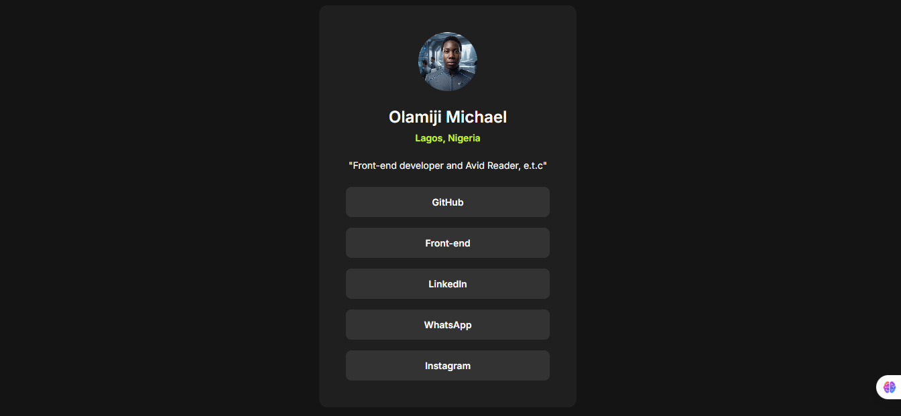

# Frontend Mentor - Social links profile solution

This is a solution to the [Social links profile challenge on Frontend Mentor](https://www.frontendmentor.io/challenges/social-links-profile-UG32l9m6dQ). Frontend Mentor challenges help you improve your coding skills by building realistic projects.

## Table of contents

- [Overview](#overview)
  - [The challenge](#the-challenge)
  - [Screenshot](#screenshot)
  - [Links](#links)
- [My process](#my-process)
  - [Built with](#built-with)
  - [What I learned](#what-i-learned)
  - [AI Collaboration](#ai-collaboration)
- [Project Code](#project-code)
  - [index.html](#indexhtml)
  - [style.css](#stylecss)
- [Author](#author)

## Overview

### The challenge

Users should be able to:

- See hover and focus states for all interactive elements on the page

### Screenshot



### Links

- Solution URL: [View Solution](https://oms-social-card.netlify.app)
- Live Site URL: [View Live Site](https://github.com/OMS-Create/oms-social-card)

## My process

### Built with

- Semantic HTML5 markup
- CSS custom properties
- Flexbox & CSS Grid
- Mobile-first workflow
- [Google Fonts (Inter)](https://fonts.google.com/specimen/Inter)

### What I learned

Working through this challenge allowed me to practice structuring clean, accessible markup and building responsive layouts using a dark theme design system. I reinforced how to implement smooth state transitions for interactive elements and handle card centering efficiently with CSS Grid.

### AI Collaboration

AI assistance was utilized during this project to help refine the layout structure, optimize CSS transitions, and ensure consistent responsive styling across desktop and mobile views.

---

## Project Code

### `index.html`

```html
<!DOCTYPE html>
<html lang="en">
<head>
	<meta charset="UTF-8">
	<meta name="viewport" content="width=device-width, initial-scale=1.0">
	<link rel="preconnect" href="https://fonts.googleapis.com">
	<link rel="preconnect" href="https://fonts.gstatic.com" crossorigin>
	<link href="https://fonts.googleapis.com/css2?family=Inter:wght@400;600;700&display=swap" rel="stylesheet">

	<link rel="icon" type="image/png" sizes="32x32" href="./assets/images/favicon-32x32.png">
	<title>Frontend Mentor | Social links</title>

	<link rel="stylesheet" href="style.css">
</head>

<body>
<main>
	<div class="profile">
		<div class="profile-img">
		
		</div>
		<h1>Olamiji Michael</h1>
	</div>
	<div class="national-origin">
		<p>Lagos, Nigeria</p>
	</div>
	<div class="Presently">
		<p>"Front-end developer and Avid Reader, e.t.c"</p>
	</div>
	
	<div class="social-links">
		<a href="https://github.com/OMS-Create" target="_blank">GitHub</a>
		<a href="https://www.frontendmentor.io/OMS-Create" target="_blank">Front-end</a>
		<a href="https://www.linkedin.com/in/olamiji-michael-segun-14a444395" target="_blank">LinkedIn</a>
		<a href="https://wa.me/2348020649566?text=hello%20want%20to%20review" target="_blank">WhatsApp</a>
		<a href="https://instagram.com" target="_blank">Instagram</a>
	</div>

	<footer class="attribution">
		Challenge by <a href="https://www.frontendmentor.io?ref=challenge" target="_blank">Frontend Mentor</a>.
		Coded by <a href="#">Olamiji Michael</a>.
	</footer>
</main>
</body>
</html>
```

### `style.css`

```css
* {
    box-sizing: border-box;
    margin: 0;
    padding: 0;
}

body {
    font-family: 'Inter', sans-serif;
    display: grid;
    place-items: center;
    min-height: 100vh;
    background: hsl(0, 0%, 8%);
    color: hsl(0, 0%, 100%);
}

main {
    background: hsl(0, 0%, 12%);
    color: white;
    padding: 40px;
    border-radius: 12px;
    width: 100%;
    max-width: 384px;
    text-align: center;
}

.profile-img {
    display: flex;
    justify-content: center;
    margin-bottom: 24px;
}

.img {
    border-radius: 50%;
    height: 88px;
    width: 88px;
    object-fit: cover;
}

.profile h1 {
    font-size: 24px;
    font-weight: 600;
    margin-bottom: 8px;
}

.national-origin {
    color: hsl(75, 94%, 57%);
    font-size: 14px;
    font-weight: 600;
    margin-bottom: 24px;
}

.Presently {
    color: hsl(0, 0%, 100%);
    font-size: 14px;
    font-weight: 400;
}

.Presently p {
    margin-bottom: 24px;
}

.social-links {
    display: flex;
    flex-direction: column;
    gap: 16px;
    width: 100%;
}

.social-links a {
    background-color: hsl(0, 0%, 20%);
    color: white;
    height: 45px;
    border-radius: 8px;
    border: none;
    width: 100%;
    text-decoration: none;
    display: grid;
    place-items: center;
    font-size: 14px;
    font-weight: 600;
    transition: background-color 0.2s ease, color 0.2s ease;
}

.social-links a:hover {
    background-color: hsl(75, 94%, 57%);
    color: hsl(0, 0%, 8%);
}

.attribution {
    font-size: 0.687rem;
    text-align: center;
    margin-top: 24px;
}

.attribution a {
    color: hsl(228, 45%, 44%);
    text-decoration: none;
}
```

## Author
- Website Upcoming 
- Frontend Mentor - [@OMS-Create](https://www.frontendmentor.io/profile/OMS-Create)
